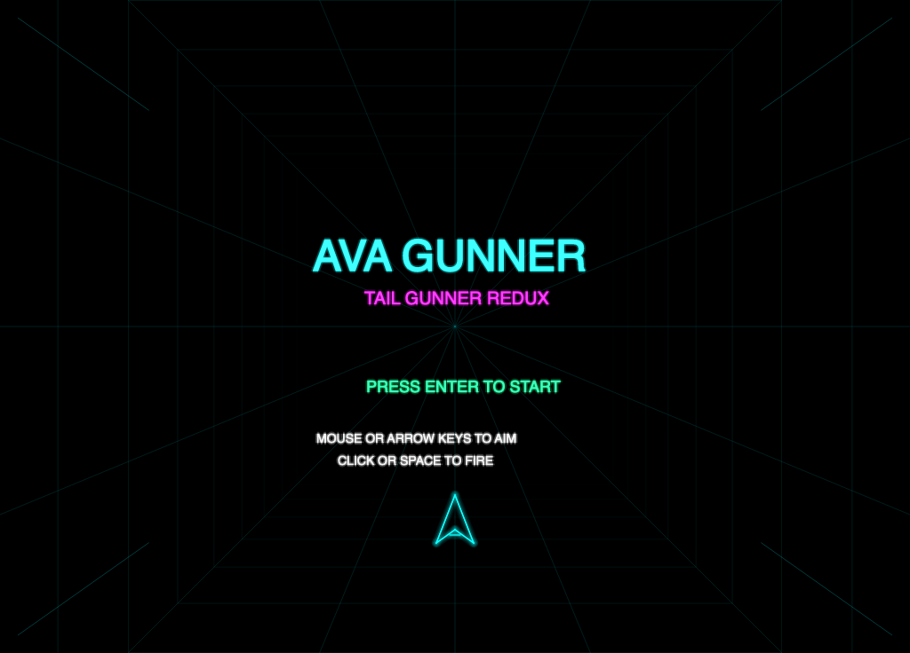
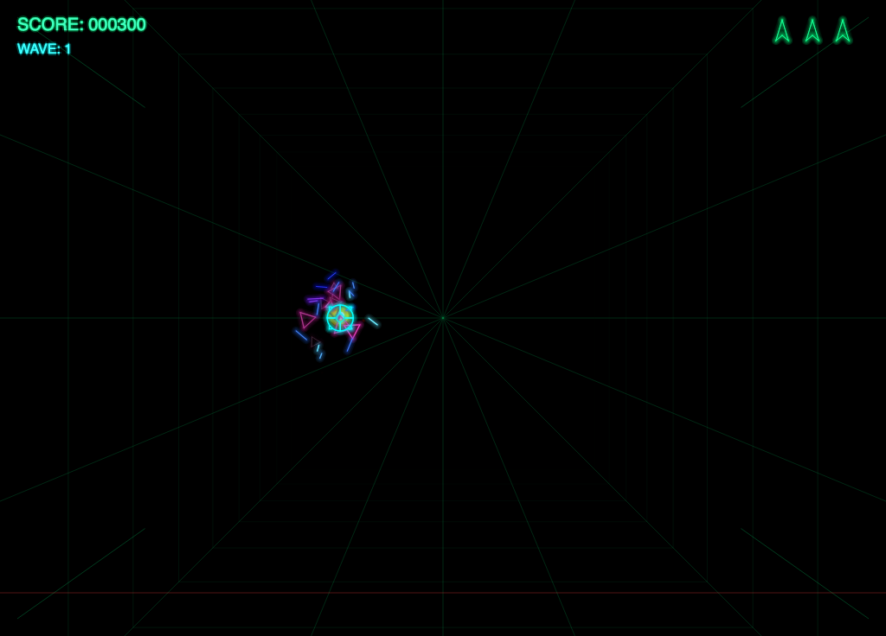
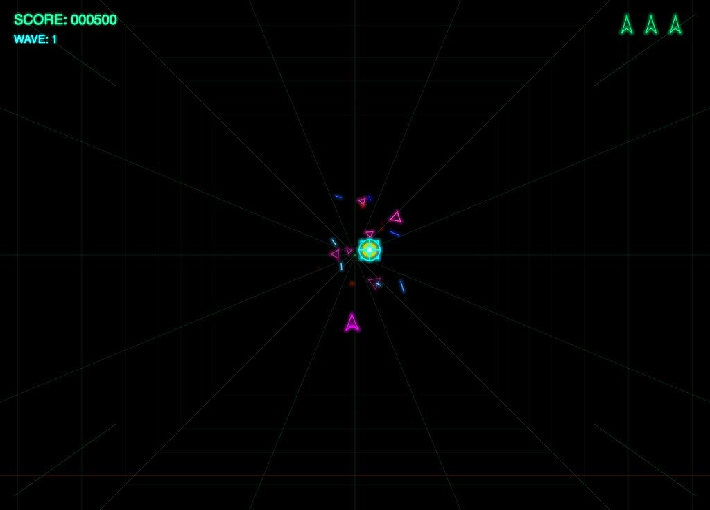
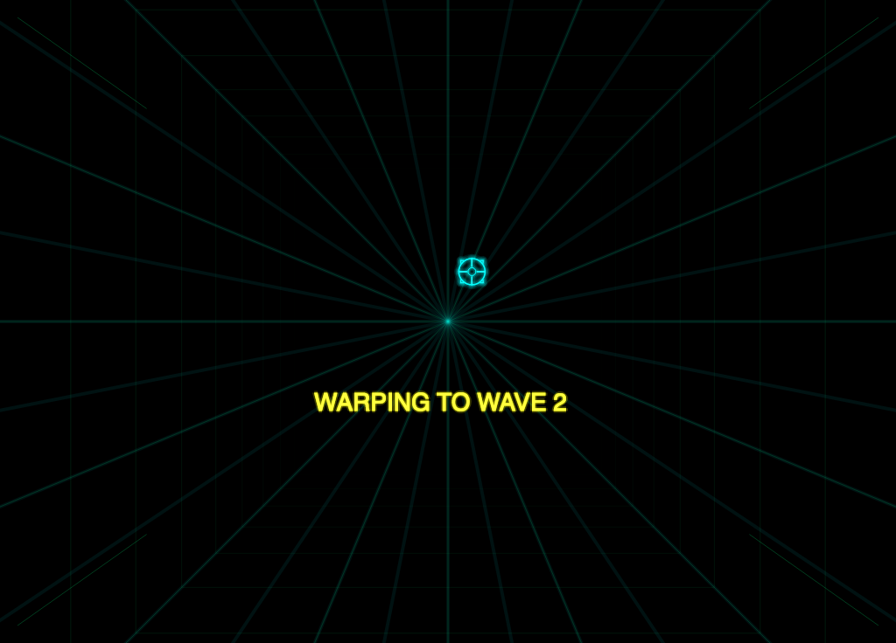
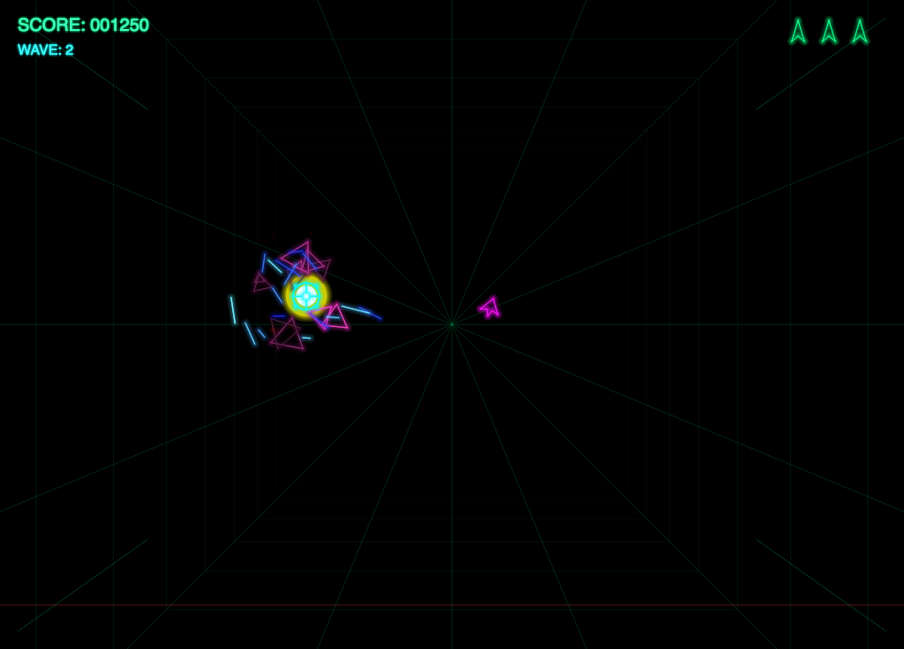
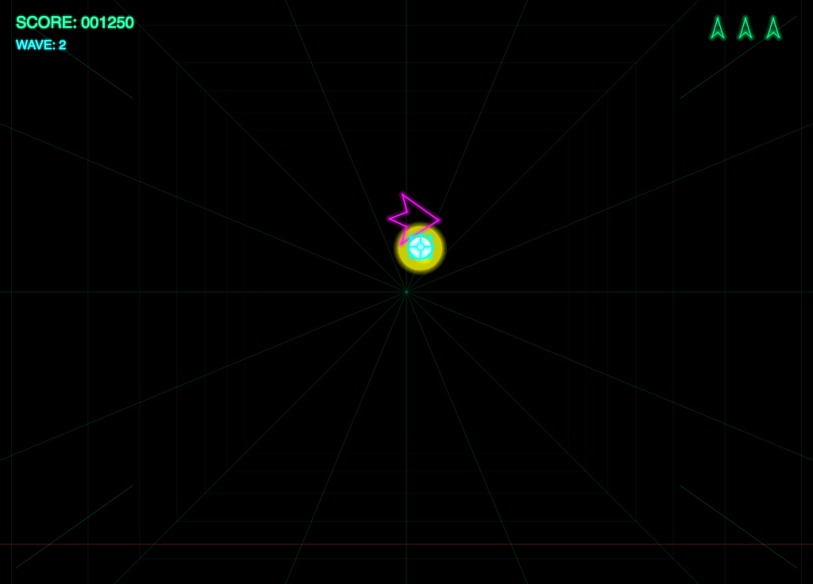
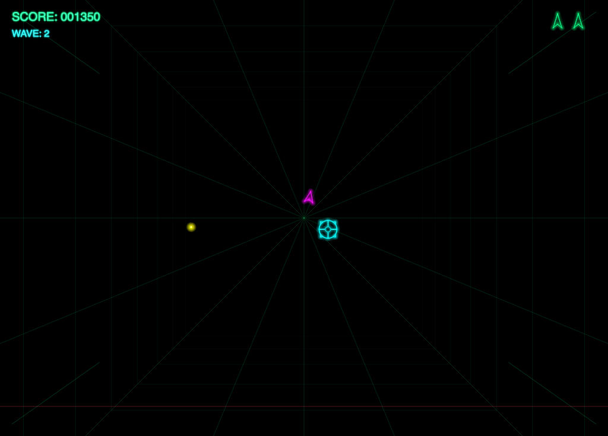
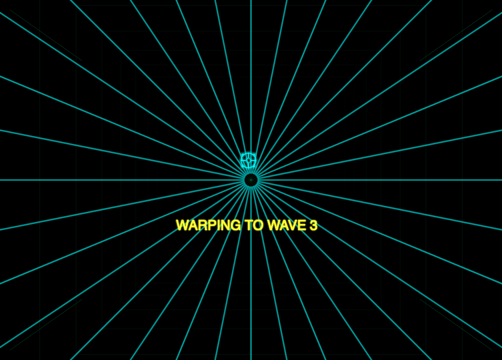

# AVAGunner

A modern reimplementation of the classic TailGunner arcade game built with .NET 9 and Avalonia UI.

## Description

AVAGunner is a rear-view perspective space shooter featuring wireframe vector graphics with neon glow effects. Defend your ship from waves of approaching enemy fighters as they fly toward you from the distance.

## Screenshots

















## Features

- Classic arcade-style gameplay
- 3D wireframe vector graphics with neon glow effects (cyan, magenta, yellow, green)
- 3D perspective rendering with enemies approaching from the distance
- Animated starfield background
- Multiple enemy types: Fighters, Bombers, Interceptors, Scouts, and Destroyers
- Curved enemy trajectories with 3D rotation and realistic flight patterns
- Defensive shield system (3 charges per wave) that bounces nearby enemies back with tumbling animation
- Explosion effects when enemies are destroyed
- Wave-based progression with increasing difficulty
- Cross-platform support (Windows, macOS, Linux)
- Mouse and keyboard input support
- Synthesized retro sound effects

## Controls

### Keyboard
- **Arrow Keys** or **WASD**: Move targeting reticle
- **Space**: Fire
- **Enter**: Start game / Resume from pause
- **V**: Activate shield
- **ESC**: Pause game (press twice while paused to exit)
- **Ctrl+S** or **Cmd+S**: Save screenshot to Documents folder

### Mouse
- **Move**: Aim targeting reticle
- **Left Click**: Fire
- **Right Click**: Activate shield

## Requirements

- .NET 9.0 SDK or later

## Building

```bash
dotnet build
```

## Running

```bash
dotnet run
```

## License

This project is licensed under the MIT License - see the [LICENSE](LICENSE) file for details.

## Author

Lonnie Watson
